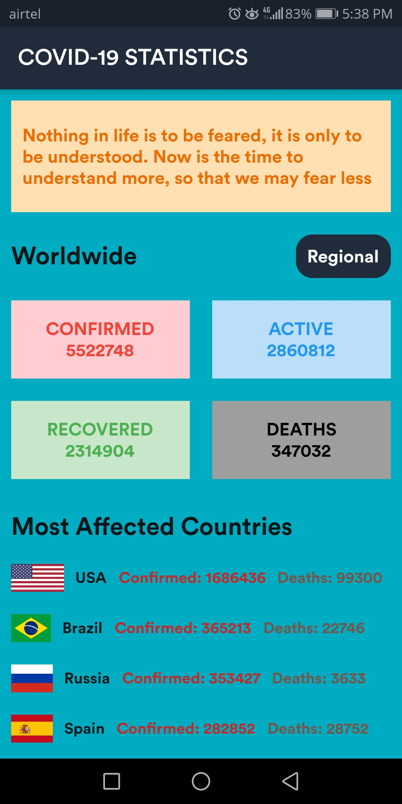
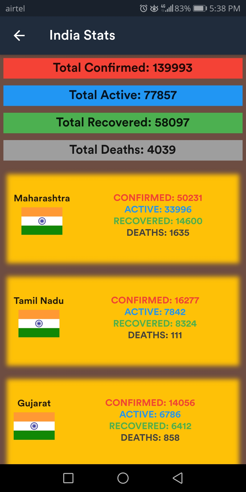

[]()
[](https://github.com/vijethph/CovidStatsApp/issues)
[](https://github.com/vijethph/CovidStatsApp/graphs/contributors)
[](https://github.com/vijethph/CovidStatsApp/network)
[](https://github.com/vijethph/CovidStatsApp/stargazers)
[](https://github.com/vijethph/CovidStatsApp/blob/master/LICENSE)
[](https://www.android.com)
[](https://forthebadge.com)

<br />
<p align="center">
  <a href="https://github.com/vijethph/CovidStatsApp">
    
  </a>

  <h2 align="center">Covid-19 Stats App</h2>

  <p align="center">
    A Flutter app that gives the updated report of Covid-19 related statistics in a neat and consistent manner.
    <br />
    <br />
    <a href="https://github.com/vijethph/CovidStatsApp/issues">Report Bug</a>
    ·
    <a href="https://github.com/vijethph/CovidStatsApp/issues">Request Feature</a>
  </p>
</p>


<!-- TABLE OF CONTENTS -->
## Table of Contents

* [About the Project](#about-the-project)
  * [Built With](#built-with)
* [Getting Started](#getting-started)
  * [Prerequisites](#prerequisites)
  * [Installation](#installation)
* [Usage](#usage)
* [Contributing](#contributing)
* [License](#license)
* [Contact](#contact)
* [Acknowledgements](#acknowledgements)


<!-- ABOUT THE PROJECT -->
## About The Project

   

This is a Flutter app that uses [Flutter UI Kit](https:/flutter.dev) and [Novel Covid API](https://corona.lmao.ninja) to retrieve the latest Covid-19 related statistics, and display them in a consistent manner. It displays various information related to the disease, such as worldwide confirmed count, most affected countries, and state-wise confirmed cases with respect to the country India. The app is also available in Kannada language.


### Built With
This project is entirely built with the following components and languages:
* [Flutter](https://flutter.dev)
* [Novel Covid API](https://corona.lmao.ninja)
* [http Dart Package](https://pub.dev/packages/http)


<!-- GETTING STARTED -->
## Getting Started

The Android app, and its Kannada version are available in the [Releases](https://github.com/vijethph/CovidStatsApp/releases) section, which can be directly downloaded and installed. To get a local copy of the program up and running, hence manually building the project, follow these simple steps.

### Prerequisites

Java Runtime Environment(JRE)>=8, Android SDK API level 28, and Flutter SDK should be installed. After installation, check Java version, and Flutter configuration using

```sh
java --version
flutter doctor
```


### Installation

1. Clone the repo
```git
git clone https://github.com/vijethph/CovidStatsApp.git
```
2. Open the downloaded folder
```sh
cd CovidStatsApp
```
3. Make sure Flutter executable is added to environment variables. Then import the required dependencies using
```sh
flutter pub get
```
4. Connect your Android device to your desktop. Make sure it is properly connected by using
```sh
flutter devices
```
Finally run the program using
```sh
flutter run
```


<!-- USAGE EXAMPLES -->
## Usage

Once the app starts, you can check the Worldwide statistics related to Covid-19, most affected countries. The 'Regional' button opens the state-wise information about India. There is also a 'Frequently Asked Questions' page based on guidelines from [WHO](https://www.who.int).


<!-- CONTRIBUTING -->
## Contributing [](https://github.com/vijethph/CovidStatsApp/pulls)


Contributions are what make the open source community such an amazing place to be learn, inspire, and create. Any contributions you make are **greatly appreciated**.

1. Fork the Project
2. Create your Feature Branch (`git checkout -b feature/AmazingFeature`)
3. Commit your Changes (`git commit -m 'Add some AmazingFeature'`)
4. Push to the Branch (`git push origin feature/AmazingFeature`)
5. Open a Pull Request


<!-- LICENSE -->
## License

Distributed under the GNU GPL License.


<!-- CONTACT -->
## Contact

Vijeth P H - [@vijethph](https://github.com/vijethph)

Project Link: [https://github.com/vijethph/CovidStatsApp](https://github.com/vijethph/CovidStatsApp)

## Thank You!
[](https://forthebadge.com)

If you like this project, please ⭐ this repo and share it with others 👍


<!-- ACKNOWLEDGEMENTS -->
## Acknowledgements
* [Flutter Docs](https://docs.oracle.com/javafx)
* [Novel Covid API](https://shields.io)
* [Choose an Open Source License](https://choosealicense.com)
* [Saheb Singh](https://github.com/singh-saheb)

